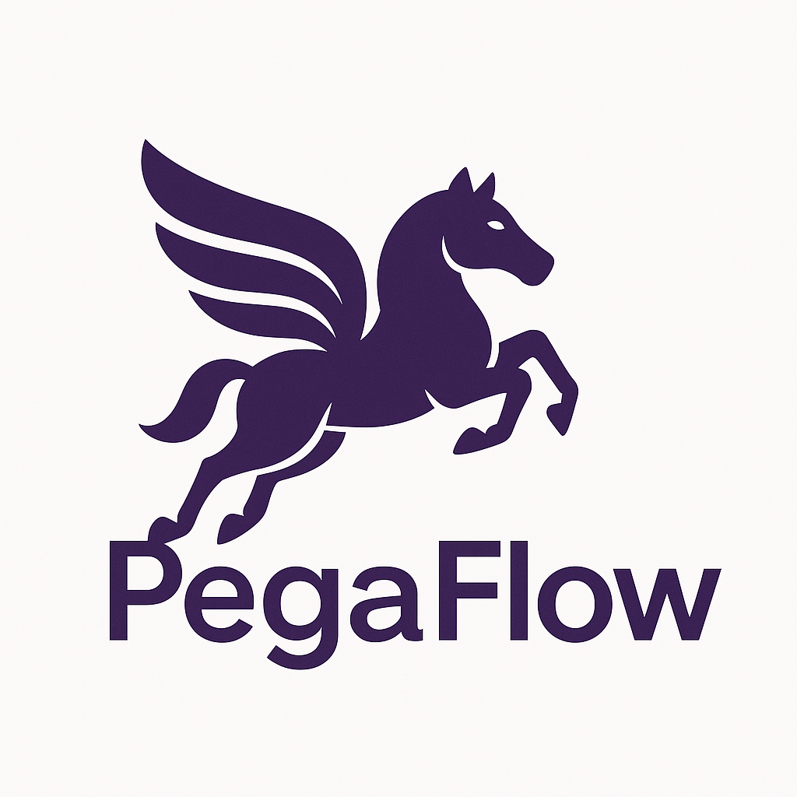

# Pegaflow

PegaFlow draws its name from Pegasus, the winged horse of ancient myth — a creature born to cross impossible distances with effortless grace.

## Goals

1. **A Data Path Purpose-Built for LLM Inference**

   Focus exclusively on the typical data flows in large model inference: data movement between prefill and decode phases, between different compute roles, and high-throughput transport of weights and KV/activations. We only solve this specific class of problems—high-bandwidth, predictable, structured data paths.

2. **RDMA-First, High-Performance Implementation**

   The initial version prioritizes RDMA, leveraging static topology, long-lived connections, and pre-allocated resources to push throughput, stability, and tail latency close to hardware limits—validating the value of a "dedicated transport layer".

3. **Developer-Friendly Abstractions**

   Provide clear, minimal transport semantics and channel models: easy to understand, simple to integrate, and predictable in behavior. Avoid hidden policies that cause mysterious performance jitter, allowing users to make confident performance assumptions.

4. **Built-In Observability and Tunability**

   Export key metrics and debugging information from day one (throughput, latency distribution, resource utilization, error signals, etc.), giving cluster operators data to guide topology and parameter tuning—rather than black-box trial-and-error.

5. **Embeddable in Existing Inference Systems**

   Serve as an optional "transport backend" that can plug into existing inference/dispatch/scheduling components—without requiring a full rewrite of the upper layers—ensuring the PoC can be validated quickly in real production stacks.

## Non-Goals

1. **Not a General-Purpose RPC or Service Framework**

   No request routing, load balancing, IDL, or serialization format wars—these concerns belong to upper layers or other projects.

2. **Not a Universal Network Virtualization Layer**

   No attempt to automatically adapt to all network environments, cloud providers, or dynamic topologies; the initial focus is deep optimization for known, controlled, performance-sensitive clusters.

3. **Not a Full-Featured Communication Middleware**

   Does not cover collectives, group communication semantics, or a comprehensive flow control ecosystem—only focused on high-value point-to-point (or few-node) bulk transfer scenarios.

4. **Not a "Runs Everywhere" Compatibility Solution**

   No compromising design sharpness for compatibility with low-spec or non-accelerated network environments; other protocols or software fallbacks are incremental extensions, not core promises.

5. **Not a Security or Compliance Component**

   No built-in complex authentication, encryption, or multi-tenant isolation; default assumption is deployment in controlled environments, with security handled by infrastructure.
